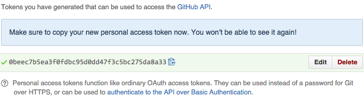

# Sync Issues for GitHub

sync_issues is a ruby gem to that allows the easy creation and synchronization
of issues on GitHub with structured local data.


## Installation

To install sync_issues run:

    gem install sync_issues


## sync_issues.yaml configuration

In order to run sync_issues you will need to create a GitHub API token with the
`public_repo` scope for creating issues only on public repositories, or the
`repo` scope for creating issues on both private and public repositories.


To create a token visit https://github.com/settings/tokens/new, and select the
appropriate scope `repo` or `public_repo` for your projects. Then click the
green "Generate Token" button to create the token.



Create a config file `$HOME/.config/sync_issues.yaml` with the following
contents ensuring that you use the access token generated for you:

```yaml
token: 0beec7b5ea3f0fdbc95d0dd47f3c5bc275da8a33
```

If you lose the page with your new access token before creating
`sync_issues.yaml`, don't fret. Delete the appropriate token, and try again.


## Running sync_issues

Run sync_issues via:

    sync_tasks /path/to/tasks/directory bboe/repo1 appfolio/repo2


## Local Issue Directory

Locally you will want to have a directory of markdown files each of which will
represent a single issue on GitHub. When syncing new issues will be created
according to lexicographic filename order if an issue doesn't already exist
with a matching title as specified in the file's frontmatter. Existing issues
will be updated if necessary.

## Issue File

Each issue file is a markdown file with a `yaml` frontmatter (a format used by
[jeykll](http://jekyllrb.com/docs/frontmatter/)).

### Task Frontmatter

The frontmatter of an issue file can contain the following attributes:

* __title__: (required) Used as the title of the issue on GitHub. The title is
  used as the unique key when syncing updated tasks with existing issues.
* __assignee__: (optional) Assign or reassign the issue to the github username
  specified. Existing assignee will not be removed on sync if the field is not
  provided.
* __label__: (optional) Set the labels of the issue to this comma-separated
  string of issues. Existing labels will not be cleared on sync when the field
  is not provided.
