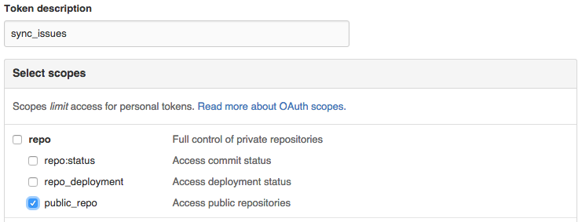

# Sync Issues for GitHub

sync_issues is a ruby gem to that allows the easy creation and synchronization
of issues on GitHub with structured local data.


## Installation

To install sync_issues run:

    gem install sync_issues


## sync_issues.yaml configuration

In order to run sync_issues you will need to create a GitHub API token with the
`public_repo` scope for creating issues only on public repositories, or the
`repo` scope for creating issues on both private and public repositories.



To create a token visit https://github.com/settings/tokens/new, and select the
appropriate scope `repo` or `public_repo` for your projects. Then click the
green "Generate Token" button to create the token.


Create a config file `$HOME/.config/sync_issues.yaml` with the following
contents ensuring that you use the access token generated for you:

```yaml
token: 0beec7b5ea3f0fdbc95d0dd47f3c5bc275da8a33
```

If you lose the page with your new access token before creating
`sync_issues.yaml`, don't fret. Delete the appropriate token, and try again.


## Running sync_issues

Run sync_issues via:

    sync_issues /path/to/tasks/directory bboe/repo1 appfolio/repo2


## Local Issue Directory

Locally you will want to have a directory of markdown files each of which will
represent a single issue on GitHub. When syncing new issues will be created
according to lexicographic filename order if an issue doesn't already exist
with a matching title as specified in the file's frontmatter. Existing issues
will be updated if necessary.

## Issue File

Each issue file is a markdown file with a `yaml` frontmatter (a format used by
[jeykll](http://jekyllrb.com/docs/frontmatter/)).

### Task Frontmatter

The frontmatter of an issue file can contain the following attributes:

* __title__: (required) Used as the title of the issue on GitHub. The title is
  used as the unique key when syncing updated tasks with existing issues.
* __assignee__: (optional) Assign or reassign the issue to the github username
  specified. Existing assignee will not be removed on sync if the field is not
  provided.
* __labels__: (optional) When provided and the issue does not have any labels
  this list of labels will be added to the issue. Labels will be dynamically
  created with the default grey color if they don't already exist on the
  repository. If you desire to reset the labels for each issue, run
  ``sync_issues`` with the ``--reset-labels`` flag.

## Synchronizing Labels

A path to a yaml file can be provided to synchronize labels on a
repository. This path is provided like so:

    sync_issues --labels yaml_file.yml task_directory org/repo

The yaml file can contain two attributes:

* __keep_existing__: (optional) When ``false`` (default ``true``) all labels
  that aren't in ``labels`` will be deleted. Set to ``false`` and provide no
  labels to clear all labels.
* __labels__: (optional) A mapping of label names to their 6-character
  hexidecimal color code without a `#` prefix. Color codes that contain only
  numeric digits, e.g., `000000`, must be contained within quotes.

### Example labels yaml file

```yaml
keep_existing: false
labels:
  in progress: bfe5bf
  merged: "009800"
  unstarted: fef2c0
  waiting on developer: f7c6c7
  waiting on reviewer: fad8c7
```
